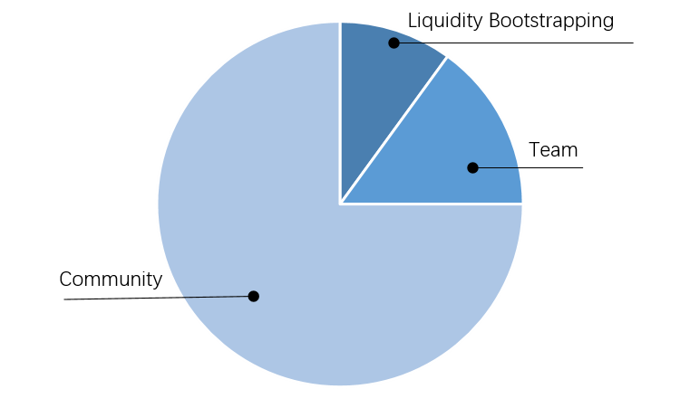

### Overview
PARA is ParaPara's native protocol token.

| Token Name | ParaPara Token |
|:--- |:--- |
| Token Ticker | PARA |
| Token Type | TRC-20 |
| Total supply | 10,000,000 |

### Value capture
When traders trade on the platform, there will be a transaction fee, which is 0.3% or 0.1% of the total nominal value depending on the trading direction. 70% fee are kept in the pool to reward LPs. The remaining portion (30%) goes to all PARA holders.

### Community governance
In the early stage, development and decision making will be mostly done by the team directly. As the project matures, everything should be gradually handed over to the community, transforming into a truly decentralized automated organization (DAO). After the transformation, all improvements and changes to the project will be done via proposals, which will be approved by voting from PARA holders.

### Token Distribution

Parapara values the inclusiveness and equality in decentralization, thus token distribution will be using the fair launch model; no pre-sale, no VC allocation, and open access for everyone.

A total of 10 million PARA tokens will be issued. The allocation is as follows:

- **An initial supply of 1million (10%)** PARA tokens is deposited into Justswap exchange to bootstrap the initial distribution. The team has deposited 500,000 TRX into the pool to provide initial liquidity. The team will not remove any liquidity before project launch on mainnet.
- **1.5million (15%)** PARA tokens are reserved for the team. This portion will only be minted after the mainnet launch with 2-4 years vesting.
- **7.5million(75%)** PARA tokens are reserved for community members to incentive liquidity providers, traders, stakers and commnunity developers who participate in the Parapara project. As Parapara transitions to community governance, distribution of ecosystem rewards will be decided by the community.

